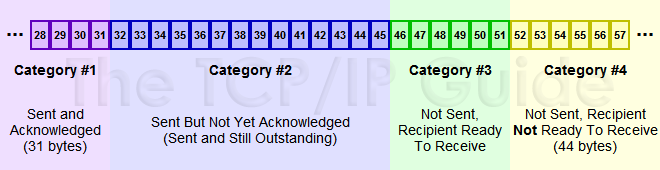

# DK的 乱 七 八 糟

## LRU高效率算法

put 和 get 方法的时间复杂度为 O(1)，我们可以总结出 cache
这个数据结构必要的条件：查找快，插入快，删除快，有顺序之分。

Get用hash， put用链表（登记hash）

什么是**服务注册与服务发现**？

**服务注册**，就是将提供某个服务的模块信息(通常是这个服务的ip和端口)注册到1个公共的组件上去（比如:
zookeeper\\consul）。

**服务发现**，就是新注册的这个服务模块能够及时的被其他调用者发现。不管是服务新增和服务删减都能实现自动发现。

你可以理解为：

//服务注册

NameServer-\>register(newServer);

//服务发现

NameServer-\>getAllServer();

应用场景：**各个微服务相互独立，每个微服务，由多台机器或者单机器不同的实例组成，各个微服务之间错综复杂的相互关联调用**。

任何情况下，处理器检测到event发生，通过异常表（exception
table）跳转到专门处理这类事件的操作系统子程序（exception handler）。

异步异常由事件产生，同步异常是执行一条指令的直接产物。  
类别包含**中断（异步）**，**陷阱（同步）**，**故障（同步）**，**终止（同步）**。

-   中断——异步发生，处理器IO设备信号的结果。

-   陷阱——有意的异常。最重要的用途是在用户程序和内核之间提供一个像过程一样的接口，叫做系统调用。

-   故障——潜在可恢复的错误造成的结果。如果能被修复，则重新执行引起故障的指令，否则终止。

-   终止——不可恢复的致命错误造成的结果。

编译器并不是把函数模板处理成能够处理任意类的函数；编译器从函数模板通过具体类型产生不同的函数；编译器会对函数模板进行两次编译：在声明的地方对模板代码本身进行编译，在调用的地方对参数替换后的代码进行编译。

字节跳动后台：tcp连接在网络不好的情况下一直重传怎么办（采用同步队列，发一个确认一个）；

客户端还必须等待 **2MSL** 个时间，这里为什么客户端还不能直接跑路呢？主要是为了防止发送出去的 **ACK** 服务端没有收到，服务端重发 **FIN** 再次来询问，如果客户端发完就跑路了，那么服务端重发的时候就没人理他了。这个等待的时间长度也很讲究。

主动关闭的一方发出 **FIN** 包（Client），被动关闭（Server）的一方响应 **ACK** 包，此时，被动关闭的一方就进入了 **CLOSE_WAIT** 状态。如果一切正常，稍后被动关闭的一方也会发出 **FIN** 包，然后迁移到 **LAST_ACK** 状态。

**布隆过滤器的原理，使用场景和注意事项**

布隆过滤器是一个 bit 向量或者说 bit 数组，长这样：

果我们要映射一个值到布隆过滤器中，我们需要使用**多个不同的哈希函数**生成**多个哈希值**

传统的布隆过滤器并**不支持**删除操作

## 最佳实践

常见的适用常见有，利用布隆过滤器减少磁盘 IO
或者网络请求，因为一旦一个值必定不存在的话，我们可以不用进行后续昂贵的查询请求。另外，既然你使用布隆过滤器来加速查找和判断是否存在，那么性能很低的哈希函数不是个好选择，推荐
MurmurHash、Fnv 这些。

为什么不用hash表？hash表在海量数据情况下可能要频繁处理冲突，捞啊。

STL中的unordered_map怎么避免冲突？**链地址法**

**解决幻读？**一种是采用SERIALIZABLE 数据隔离级别

另一种方案是采用在RR数据隔离级别下，手动给select操作加上x锁（排它锁）或者s锁（共享锁）

**共享锁**（SELECT ... LOCK IN SHARE
MODE）即一个事务获取一条记录共享锁的同时，其他事务也可以获得这条记录的共享锁，但是如果同时有多个事务获得这条记录的共享锁，谁也无法修改这条记录，直到都释放掉共享锁，只剩下一个事务拥有这条记录的锁为止。

**排它锁**（SELECT ... FOR
UPDATE）即一个事务获得了一条记录的排它锁的同时，其他事务就不能获得这条记录的共享锁和排它锁，也无法修改这条记录，直到这个事务释放掉锁为止。

。

C++智能指针：

| **指针类别** | **支持**     |                                       |
|              |              | **备注**                              |
|--------------|--------------|---------------------------------------|
| unique_ptr   | C++ 11       | 拥有独有对象所有权语义的智能指针      |
| shared_ptr   | C++ 11       | 拥有共享对象所有权语义的智能指针      |
| weak_ptr     | C++ 11       | 到 std::shared_ptr 所管理对象的弱引用 |
| auto_ptr     | C++ 17中移除 | 拥有严格对象所有权语义的智能指针      |

主要职能指针分为两个unique_ptr和shared_ptr

std::unique_ptr 是通过指针占有并管理另一对象，并在 unique_ptr
离开作用域时释放该对象的智能指针。在下列两者之一发生时用关联的删除器释放对象：

-   销毁了管理的 unique_ptr 对象

-   通过 operator= 或 reset() 赋值另一指针给管理的 unique_ptr 对象。

>   unique_ptr可以用=号赋值吗？ 不可。

std::shared_ptr 是通过指针保持对象共享所有权的智能指针。多个 shared_ptr
对象可占有同一对象。下列情况之一出现时销毁对象并解分配其内存：

-   最后剩下的占有对象的 shared_ptr 被销毁；

-   最后剩下的占有对象的 shared_ptr 被通过 operator= 或 reset() 赋值为另一指针。

主要解决内存泄漏

shared_ptr都会问维护的对象是不是线程安全的，然后问引用计数是不是线程安全的。引用计数源码使用原子操作实现，肯定是线程安全的。

C++ 中有 4 种存储周期：

automatic

static

dynamic

thread

 thread_local
关键字修饰的变量具有线程（thread）周期，这些变量在线程开始的时候被生成，在线程结束的时候被销毁，并且每一个线程都拥有一个独立的变量实例。

C++引用计数（智能指针相关）

# 在一台内存为2G的机器上，malloc(20G) 会怎样？如果是new(20G) 会怎样？

-   首先，malloc和new申请的都是虚拟内存

-   malloc函数的实质，有一个将可用的内存块连接起来的链表，调用malloc的时候，会沿着链表找一个满足用户需求的内存块。然后将这个内存块一分为二，一块和用户所申请的内存大小相同，另一块返回到链表中。如果用户申请一个大的内存块，空闲链表上可能没有可以满足用户要求的片段，这个时候malloc函数就会请求延时，对链表上的内存进行整理。如果还是不可以的话，
    内存申请失败，返回NULL

-   new的话，底层实现还是malloc，在分配失败的时候会抛出bad_alloc类型的异常

**Functor 仿函数**

      所谓仿函数，是定义了operator()的对象，下面这个例子：

FunctionObject fo;

fo();

其中表达式fo()是调用仿函数fo的operator()。而非调用函数fo().

1.  仿函数是对象，可以拥有成员函数和成员变量，即仿函数拥有状态(states)

2.  每个仿函数都有自己的类型

3.  仿函数通常比一般函数快（很多信息编译期确定）

**函数指针**是指向函数的指针变量，本质是一个指针。而**指针函数**是返回值为指针的一个函数，本质是一个函数。**仿函数**实质上是一个重载了（）运算符的对象；

**Lambda函数：编译器会把一个lambda表达式生成一个匿名类的匿名对象，并在类中重载函数调用运算符。（实质上是一个functor）**

## 惊群效应是什么

惊群效应（thundering
herd）是指多进程（多线程）在同时阻塞等待同一个事件的时候（休眠状态），如果等待的这个事件发生，那么他就会唤醒等待的所有进程（或者线程），但是最终却只能有一个进程（线程）获得这个时间的“控制权”，对该事件进行处理，而其他进程（线程）获取“控制权”失败，只能重新进入休眠状态，这种现象和性能浪费就叫做惊群效应。

单机情况下惊群效应通常发生在Linux，Nginx等系统里多个进程等待fd同时被唤醒的情况，解决办法一般是在内核或者系统里，一般不需要上层开发者去处理。分布式系统因为很高的自由度，惊群效应就需要开发者去了解和提出解决办法。

**Solve:** most unix/linux kernels serialize response to accept(2)s, in other
words, only one thread is waken up if more than one are blocking on accept(2)
against a single open file descriptor.

# 海量数据排序——如果有1TB的数据需要排序，但只有32GB的内存如何排序处理？

**思路：不能内排序，那我就外排序，同时优化思路是IO尽可能小。**

**解决方案：分块，块内做内排序（qsort），产生n块有序块，然后每块按序读到内存，做块间数据归并，最后1TB有序**

扩展：海量数据排序，内存够大，怎么做？

1.  如果是无重复整型，果断位排序，（编程珠玑有介绍）。

2.  如果有重复的整型，果断计数排序，

3.  如果是字符串，果断字典树来排序

**TCP滑动窗口结构**

接收窗口的结构

**1.  Received and ACK Not Send to
Process：这部分数据属于接收了数据但是还没有被上层的应用程序接收，也是被缓存在窗口内**

**2.  Received  Not ACK: 已经接收并，但是还没有回复ACK，这些包可能输属于Delay
ACK的范畴了**

**3.  Not Received：有空位，还没有被接收的数据。**

接收端的Window
Size通告也是会变化的，接收端根据这个值来确定何时及发送多少数据，从对数据流进行流控

**拥塞控制和流量控制的区别**

拥塞控制：拥塞控制是作用于网络的，它是防止过多的数据注入到网络中，避免出现网络负载过大的情况；常用的方法就是：（
1 ）慢开始、拥塞避免（ 2 ）快重传、快恢复。 

流量控制：流量控制是作用于接收者的，它是控制发送者的发送速度从而使接收者来得及接收，防止分组丢失的。

## hot key与big key在redis中的问题

Hot key，即热点 key，一段时间内，该 key 的访问量远远高于其他的 redis key，
导致大部分的访问流量在经过 proxy 分片之后，都集中访问到某一个 redis 实例上。hot
key 通常在不同业务中，存储着不同的热点信息。比如

1.  新闻应用中的热点新闻内容；

2.  活动系统中某个用户疯狂参与的活动的活动配置；

3.  商城秒杀系统中，最吸引用户眼球，性价比最高的商品信息；

4.  ……

解决方案

1.  本地缓存

2.  利用分片算法的特性，对key进行打散处理：hot
    key加上前缀或者后缀，经过分片分布到不同的实例上，将访问量均摊到所有实例

big key即数据量大的 key
，由于其数据大小远大于其他key，导致经过分片之后，某个具体存储这个 big key
的实例内存使用量远大于其他实例，造成，内存不足，拖累整个集群的使用。big key
在不同业务上，通常体现为不同的数据，比如

**对 big key 进行拆分**

可以拆大json，大list

上面写的对 big key 存储的数据 （big value）进行拆分，变成value1，value2…
valueN，是相应的原来这个key也要拆分成多个key么？获取时再分别获取这几个key/value后组装在一起？YES

### redis-cluster设计

Redis-Cluster采用无中心结构
（可以部署主从模式），每个节点保存数据和整个集群状态,每个节点都和其他所有节点连接。

Redis
Cluster中节点负责存储数据，记录集群状态，集群节点能自动发现其他节点，检测出节点的状态，并在需要时剔除故障节点，提升新的主节点

PING-PONG机制彼此互联，

Redis Cluster在设计中没有使用一致性哈希（Consistency
Hashing），而是使用数据分片（Sharding）引入哈希槽（hash slot）来实现

### Redis-cluster的同步？

分两种：全量同步（RDB文件同步）与命令广播+增量同步；**如果某一个子节点A短暂的断连了T秒，那么A再次恢复连接之后该如何同步数据呢？**Redis选择的做法是开辟一个缓冲区（默认大小是1M)，每次处理完命令之后，先写入缓冲区repl_backlog,
然后再发送给子节点。这就是增量复制（也叫部分复制）；

涉及到数据过期时，Redis采用的做法是当Master节点判断某个key过期了之后会向子节点发送DEL命令删除掉数据。

### 跳表（Skiplist）与其他数据结构的对比

跳表都可以达到平衡树的效率（查询节点支持平均O（lgN），最坏O（N）的复杂度），但实现和维护起来却比平衡树简单很多。

**Zset**

zset底层的存储结构包括ziplist或skiplist，在同时满足以下两个条件的时候使用ziplist，其他时候使用skiplist

### 网络地址分类

Q:网络中想分配n台主机，怎么设定子网掩码？

A:首先计算N = log(n)向上取整，子网掩码需要最后N位0，其他位为1

Q:已知子网掩码，如何算容纳多少台主机？

A:看子网掩码二进制最后多少连续0（e.g.
N），容纳2\^N-2（除去**网络地址**和**广播地址**）

空类的大小： sizeof（一个空的类） = **1**。

重申：构造函数（constructor）不能是virtual的。没有这种东西。

析构函数可以是virtual的。因为有的时候用base class建立了了一个derived
object，那这时就需要在析构的时候叫对应的析构函数。

静态（static）函数也别virtual了。不合理。

什么是线程安全？（2012年5月百度实习生面试）

如果多线程的程序运行结果是可预期的，而且与单线程的程序运行结果一样，那么说明是“线程安全”的。

### Redis定义了几种策略用来处理内存满，需要淘汰的情况：

（20字节抖音提前批）

**noeviction(默认策略)**：对于写请求不再提供服务，直接返回错误（DEL请求和部分特殊请求除外）

**allkeys-lru**：从所有key中使用LRU算法进行淘汰

**volatile-lru**：从设置了过期时间的key中使用LRU算法进行淘汰

**allkeys-random**：从所有key中随机淘汰数据

**volatile-random**：从设置了过期时间的key中随机淘汰

**volatile-ttl**：在设置了过期时间的key中，根据key的过期时间进行淘汰，越早过期的越优先被淘汰

### InnoDB底层怎么实现不同的事务隔离级别？

是通过MVCC,即多并发版本控制

### 什么是共享锁和排它锁

**共享锁**（SELECT ... LOCK IN SHARE
MODE）即一个事务获取一条记录共享锁的同时，其他事务也可以获得这条记录的共享锁，但是如果同时有多个事务获得这条记录的共享锁，谁也无法修改这条记录，直到都释放掉共享锁，只剩下一个事务拥有这条记录的锁为止。

**排它锁**（SELECT ... FOR
UPDATE）即一个事务获得了一条记录的排它锁的同时，其他事务就不能获得这条记录的共享锁和排它锁，也无法修改这条记录，直到这个事务释放掉锁为止。

分布一致性算法： Raft， Paxos

### Sentinel系统

**Sentinel集群故障检测**  
1) 每1秒，向主服务器，从服务器，其他sentinel实例发送ping命令  
有效回复：+PONG, -Loading,+MASTERDOWN三种回复一种  
无效回复：除以上三种回复之外的回复，或者在指定时限内没有返回的回复  
Sentinel.conf -\> Sentinel down-master-millsenconds master 50000  
(当连续50秒，sentinel都接收到无效请求或者无回复时，就会将master标记为主观下线)  
2)
主观下线之后，向其他sentinel发送询问命令，如果达到配置中指定的数量时，则标记master为客观下线

**Sentinel集群故障转移**  
1）选出一台Sentinel-leader，来进行故障转移操作（raft协议，过半选举）  
if (winner && (max_votes \< voters_quorum \|\| max_votes \< master-\>quorum))  
2）领头sentinel在已下线的从服务器里面，挑选一个从服务器，并将其转换为主服务器  
3）让已下线主服务器属下的所有从服务器改为复制新的主服务器  
4）将已下线主服务器设置为新的主服务器的从服务器，当这个旧的主服务器重新上线

如何选择？服务器优先级（取最高），复制偏移量（取最大），运行ID（取最小）

### 脑裂（Split-Brain）

集群中部分节点之间不可达,不同分裂的小集群会自主的选择出master节点，造成原本的集群会同时存在多个master节点。广义地解决Split-Brain的问题，一般有3种方式:

1. Quorums，过半选举的方式

2. 采用Redundant
communications，冗余通信的方式，集群中采用多种通信方式，防止一种通信方式失效导致集群中的节点无法通信。

　　3. Fencing,
共享资源的方式，比如能看到共享资源就表示在集群中，能够获得共享资源的锁的就是Leader，看不到共享资源的，就表示本身结点出现问题，则停止服务。
